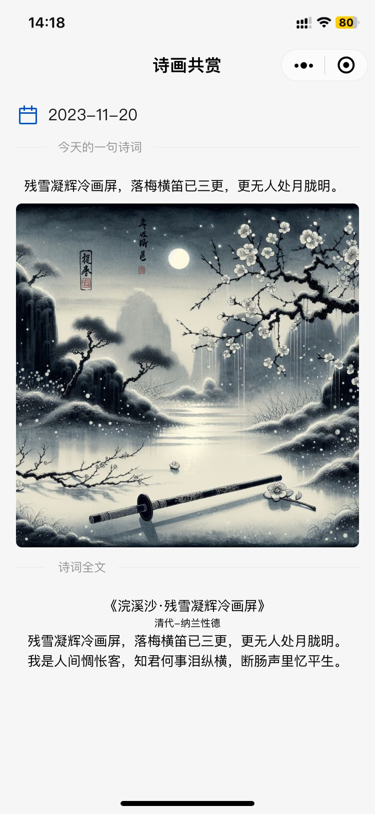

### “诗画共赏”小程序前端代码。
#### 运行截图

#### 体验小程序⬇️

最开始用Taro+VUE3+[NutUI](https://nutui.jd.com/taro/vue/4x/#/zh-CN/guide/intro)开发，感觉有点卡。后来用原生的微信小程序+[TDesign](https://tdesign.tencent.com/miniprogram/overview)重构了现在这个版本。

后端代码地址: [vertx starter](https://github.com/yangchuang/vertx-starter)