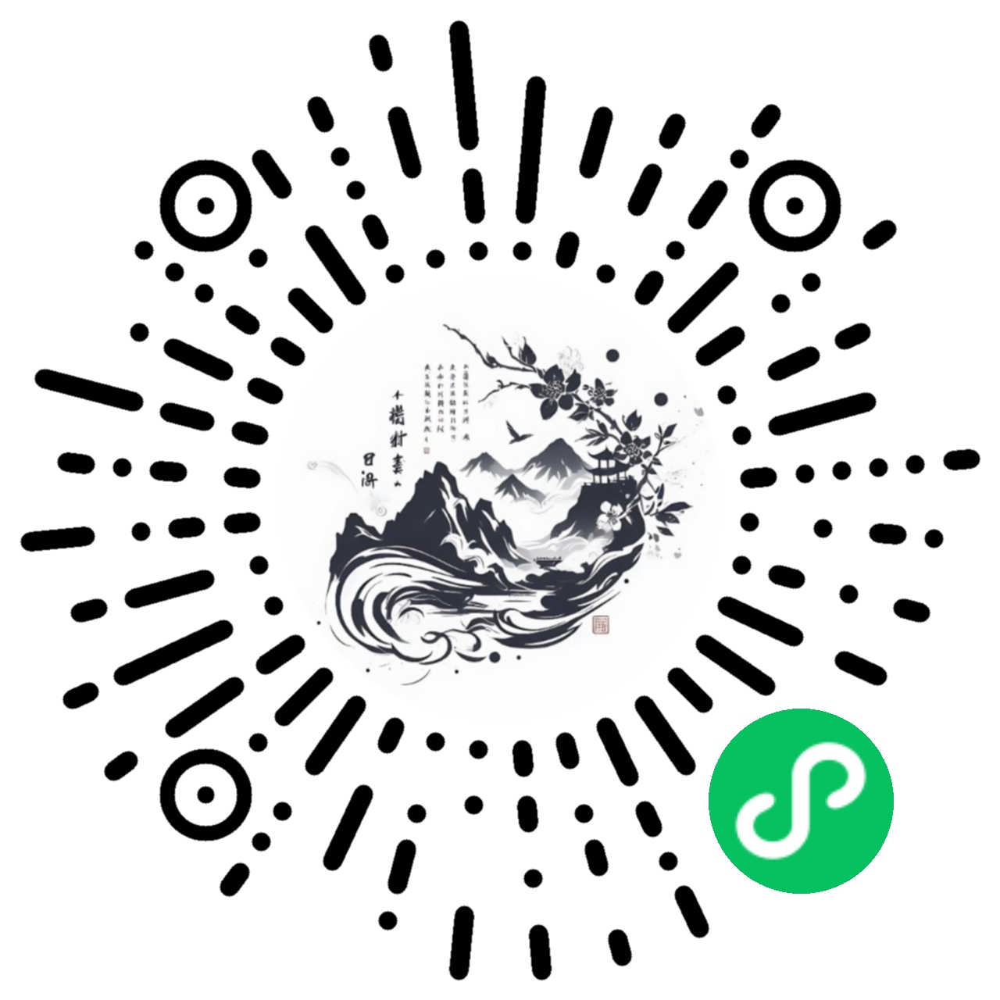

## 诗画共赏

“诗画共赏”是一个展示唐诗宋词和DALL-E3 AI配图的小程序。每天，你可以在这里欣赏到一首精选的唐诗宋词，以及根据诗句生成的DALL-E3 AI配图。

#### 运行截图


#### 体验小程序⬇️



最开始用Taro+VUE3+[NutUI](https://nutui.jd.com/taro/vue/4x/#/zh-CN/guide/intro)开发，感觉有点卡。后来用原生的微信小程序+[TDesign](https://tdesign.tencent.com/miniprogram/overview)重构了现在这个版本。

TDesign需要执行下面的npm命令安装, 安装之后通过微信开发工具的 “工具➡️构建npm” 生成`miniprogram_npm`
```
npm init
npm i tdesign-miniprogram -S --production
```

## 后端代码

[vertx starter](https://github.com/yangchuang/vertx-starter)

## 感谢 
- 使用[古诗词API](https://github.com/xenv/gushici)，自己部署了一套服务，数据集来源于 [花间集](https://github.com/chinese-poetry/huajianji)的诗词部分
- [https://devv.ai/](https://devv.ai/) 很好用的一个AI搜索引擎，帮我这个后台开发解决了很多前端微信小程序开发的问题
- [edge-tts](https://github.com/rany2/edge-tts) 将诗词转语音 
- 使用[ChatGPT-Next-Web](https://github.com/Yidadaa/ChatGPT-Next-Web) 部署到vercel作为代理使国内的服务器可以访问OpenAI的DALL-E API

## 灵感来源

- [yihong0618/2023](https://github.com/yihong0618/2023)

## 小程序的logo也是用DALL-E3画的😊
